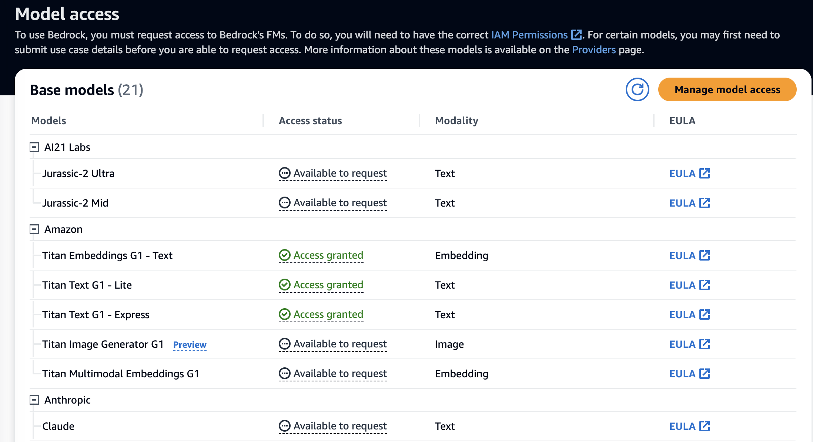

# titan-examples

Sample code on how to use [AWS Titan](https://aws.amazon.com/bedrock/titan/) and other Open Source models from BedRock such as Mistral and LLama. You will need to request access via `Model Access`

Also see my [bedrock links](https://github.com/mdfranz/cheetsheetz/blob/main/aws/bedrock.md)




# View Models

```
$ aws bedrock list-foundation-models | jq '.modelSummaries[]|.modelId' | egrep '(titan|llama|mistral)'
"amazon.titan-tg1-large"
"amazon.titan-embed-g1-text-02"
"amazon.titan-text-lite-v1:0:4k"
"amazon.titan-text-lite-v1"
"amazon.titan-text-express-v1:0:8k"
"amazon.titan-text-express-v1"
"amazon.titan-embed-text-v1:2:8k"
"amazon.titan-embed-text-v1"
"amazon.titan-embed-image-v1:0"
"amazon.titan-embed-image-v1"
"amazon.titan-image-generator-v1:0"
"amazon.titan-image-generator-v1"
"meta.llama2-13b-chat-v1:0:4k"
"meta.llama2-13b-chat-v1"
"meta.llama2-70b-chat-v1:0:4k"
"meta.llama2-70b-chat-v1"
"meta.llama2-13b-v1:0:4k"
"meta.llama2-13b-v1"
"meta.llama2-70b-v1:0:4k"
"meta.llama2-70b-v1"
"mistral.mistral-7b-instruct-v0:2"
"mistral.mixtral-8x7b-instruct-v0:1"
```
